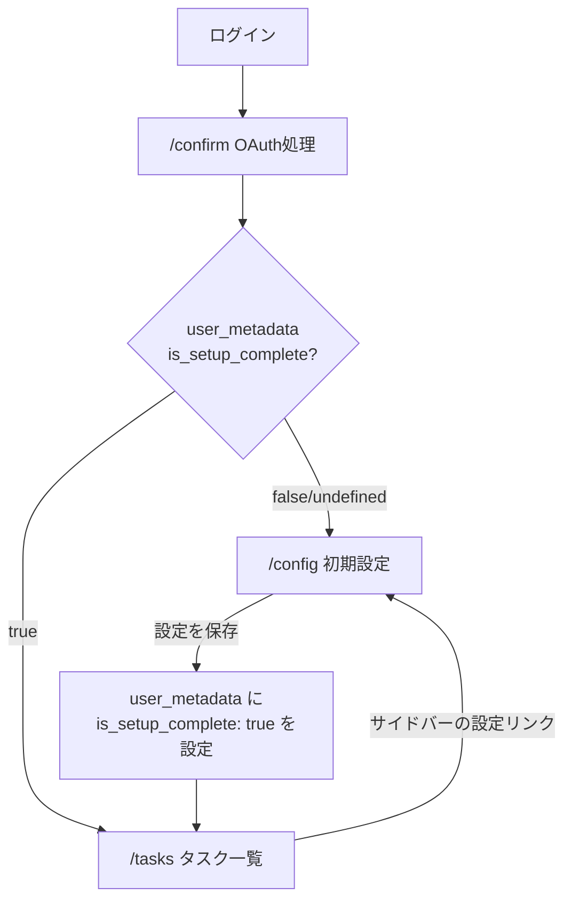

# /config 初期設定ページの実装

## 現状の課題

- `useTaskStore.ts` はモックデータのみで、DBとの連携が未実装
- lists/statuses 専用の API エンドポイントが存在しない
- `statuses` テーブルに `color` カラムがない
- 初期設定フローが未実装（ログイン後、直接 `/` に遷移するのみ）
- `database.ts` の型で `statuses.list_id` が non-nullable になっている（SCHEMA.md ではnullable）、`statuses.user_id` が欠落している

## 設計方針

- **セットアップ判定**: `auth.users` の `user_metadata.is_setup_complete` フラグを使用
- **ページの役割**: 初期設定 + 後からの設定変更を兼用（サイドバーからもアクセス可能）
- **初期値**: リスト=「Inbox」(is_inbox=true)、ステータス=「未対応(#94a3b8)」「対応中(#0ea5e9)」「完了(#10b981)」

## フロー図



## 実装ステップ

### Step 1: DB スキーマ変更 + 型更新

SQL マイグレーション（手動実行用ファイルを `docs/migrations/` に作成）:

```sql
ALTER TABLE statuses ADD COLUMN color TEXT DEFAULT '#94a3b8';
```

[`packages/shared/types/database.ts`](packages/shared/types/database.ts) の `statuses` セクションを更新:
- `color: string | null` を Row/Insert/Update に追加
- `list_id` を `string | null`（nullable）に修正
- `user_id: string` を Row/Insert/Update に追加

[`packages/shared/index.ts`](packages/shared/index.ts) は既に `Tables<'statuses'>` で自動的に反映されるため変更不要。

[`docs/SCHEMA.md`](docs/SCHEMA.md) の statuses テーブルに `color TEXT DEFAULT '#94a3b8'` を追加。

### Step 2: サーバー API エンドポイント作成

**Lists CRUD** (`apps/web/server/api/v1/lists/`):
- `index.get.ts` - ユーザーのリスト一覧取得（sort_order順）
- `index.post.ts` - リスト作成（name, is_inbox, sort_order）
- `[id].patch.ts` - リスト更新
- `[id].delete.ts` - リスト削除（Inbox は削除不可）

**Statuses CRUD** (`apps/web/server/api/v1/statuses/`):
- `index.get.ts` - ユーザーのステータス一覧取得
- `index.post.ts` - ステータス作成（name, category, color, list_id, sort_order）
- `[id].patch.ts` - ステータス更新
- `[id].delete.ts` - ステータス削除

**セットアップ API** (`apps/web/server/api/v1/setup/`):
- `init.post.ts` - 初期データ一括作成（Inbox + 3ステータス）+ `user_metadata.is_setup_complete = true` を設定。既に設定済みの場合は 409 を返す

### Step 3: クライアントミドルウェア作成

[`apps/web/middleware/setup.global.ts`](apps/web/middleware/setup.global.ts) を新規作成:
- 認証済みユーザーが `/login`, `/confirm`, `/config` 以外のページにアクセス時に実行
- `user_metadata.is_setup_complete` が falsy なら `/config` にリダイレクト

### Step 4: /config ページ実装

[`apps/web/pages/config.vue`](apps/web/pages/config.vue) を新規作成。Figma デザインに準拠したレイアウト:

- **ヘッダー**: 既存レイアウト(`layouts/default.vue`)は使わず `layout: false` で独自ヘッダー（ロゴ + ユーザー名）
- **メインエリア**: 2カラムグリッド
  - 左: **リスト管理** - リスト一覧（ドラッグハンドル付き）+ 「新しいリストを追加」ボタン
  - 右: **ステータス管理** - ステータス一覧（色丸 + 名前 + 説明 + カラーピッカー）+ 「新しいステータスを追加」ボタン
- **フッター**: 自動保存メッセージ + 「キャンセル」 + 「設定を保存」ボタン

初回アクセス時（データなし）: 空状態で表示、保存時に `setup/init` API を呼んで初期データ作成
以降のアクセス時: 既存データを読み込んで表示、個別のCRUD APIで操作

BEM クラス設計: `.config` ブロック、SCSS でプロジェクトのデザイントークン（`color()`, `spacing()`, `radius()` 等）を使用。

### Step 5: confirm.vue のリダイレクト更新

[`apps/web/pages/confirm.vue`](apps/web/pages/confirm.vue) の watch を修正:
- ユーザー取得後、`user_metadata.is_setup_complete` を確認
- true なら `/tasks` へ、false/undefined なら `/config` へ遷移

### Step 6: サイドバーに設定リンク追加

[`apps/web/components/AppSidebar.vue`](apps/web/components/AppSidebar.vue) のフッターエリアに「設定」リンクを追加（`Settings` アイコン + `/config` へのリンク）。

### Step 7: nuxt.config.ts の redirectOptions 更新

[`apps/web/nuxt.config.ts`](apps/web/nuxt.config.ts) の `supabase.redirectOptions.exclude` に `/config` を追加し、未認証リダイレクトの除外対象とする（ミドルウェアで別途制御）。

## 注意事項

- Figma デザインでステータスの各色は `#10b981`(緑/完了)、`#0ea5e9`(青/進行中)、`#f97316`(オレンジ/要確認) が使用されている。初期値の「未対応」は `#94a3b8`（グレー系）を使用する
- 現在の `useTaskStore.ts` のモックデータは今回のスコープでは維持し、tasks ページの DB 連携は別タスクとする
- `statuses` テーブルの `user_id` 欠落と `list_id` の nullable 修正は、`database.ts` の型のみ修正（実DB は SCHEMA.md 通りであると想定）
