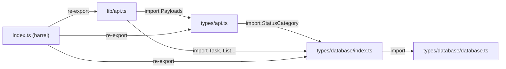

# types/database ディレクトリ再構成

## 現状の問題

```
index.ts ──export──> types/api.ts (re-export)
   │                     │
   │ defines:             │ defines:
   │ StatusCategory       │ StatusCategory (重複!)
   │ Task, List, etc.     │
   │                     │
   └──import──> types/database.ts
```

- `StatusCategory` が `index.ts` と `types/api.ts` で二重定義（DRY違反）
- `lib/api.ts` が `../index` から `Task`, `List` 等をインポートしており、パッケージルートへの逆依存が発生
- DB派生型の定義が `index.ts` に混在し、責務が不明確

## 再構成後の構造

```
packages/shared/
  types/
    database/
      database.ts   ← Supabase自動生成（移動元: types/database.ts）
      index.ts      ← DB派生型の定義（移動元: index.tsの型定義部分）
    api.ts          ← APIペイロード型（StatusCategoryを ./database からインポート）
  lib/
    api.ts          ← APIクライアント（型を ../types/database, ../types/api からインポート）
  index.ts          ← パッケージバレル（再エクスポートのみ）
```

依存の流れ:



## 変更ファイル

### 1. types/database/database.ts（移動）

- `types/database.ts` を `types/database/database.ts` に移動（内容変更なし）

### 2. types/database/index.ts（新規作成）

現在の `index.ts` L1-21 にあるDB関連の型定義・再エクスポートをここに移動:

```typescript
export {
  type Database,
  type Json,
  type TablesInsert,
  type TablesUpdate,
  type CompositeTypes,
  Constants,
} from './database';

import type { Database } from './database';

export type Tables<T extends keyof Database['public']['Tables']> = ...;
export type Enums<T extends keyof Database['public']['Enums']> = ...;

export type Task = Tables<'tasks'>;
export type List = Tables<'lists'>;
export type Status = Tables<'statuses'>;
export type PersonalAccessToken = Tables<'personal_access_tokens'>;
export type PushSubscription = Tables<'push_subscriptions'>;

export type StatusCategory = Enums<'status_category'>;
```

### 3. types/api.ts（修正）

- `import type { Database } from './database'` + ローカル StatusCategory 定義を削除
- `import type { StatusCategory } from './database'` に変更（types/database/index.ts を参照）

### 4. lib/api.ts（修正）

- `import type { List, Status, Task } from '../index'` を `import type { List, Status, Task } from '../types/database'` に変更

### 5. index.ts（簡素化）

型定義ロジックを全て除去し、純粋なバレルファイルに:

```typescript
export * from './types/database';
export * from './types/api';
export { createApiClient, type ApiClient } from './lib/api';
```

### 6. supabase/config.toml（修正）

Supabase型の自動生成先を新しいパスに設定:

```toml
[gen.types.typescript]
output = "packages/shared/types/database/database.ts"
```

これにより `supabase gen types` 実行時に新パスへ直接出力される。

### 7. 外部ファイル（変更なし）

`@nusk/shared` からインポートしている外部ファイル（web側の composable, server 等）は、パッケージの公開APIが変わらないため変更不要。
