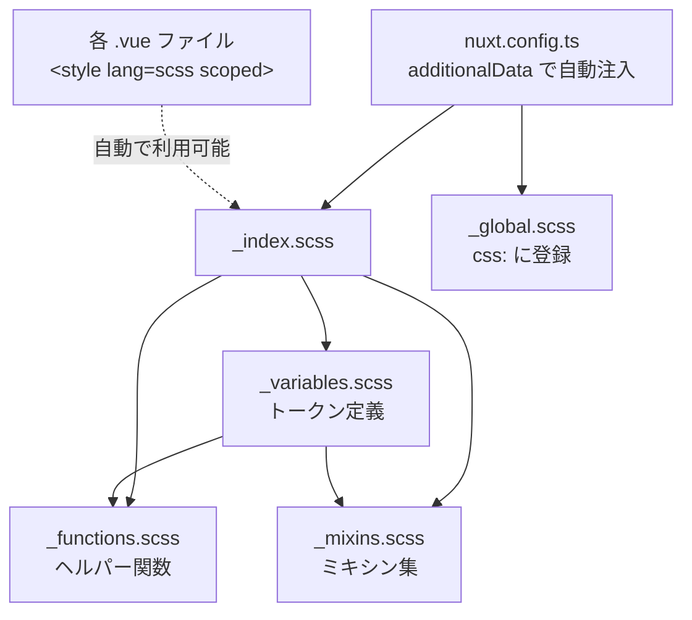

# Figmaデザインからのデザインシステム構築

## 現状の課題

現在、全てのスタイル値（色 `#f97316`、フォントサイズ `1.5rem`、パディング `24px` 等）が各Vueファイルにハードコードされており、一貫性・保守性に問題がある。共有スタイルの仕組みが存在しない。

## ファイル構成

```
apps/web/assets/scss/
├── _index.scss          # @forward でまとめるエントリポイント
├── _variables.scss      # デザイントークン（変数 + マップ）
├── _functions.scss      # ヘルパー関数（spacing(), font-size() 等）
├── _mixins.scss         # ミキシン集
└── _global.scss         # グローバルリセット・ベーススタイル
```



## 設計の詳細

### 1. `_variables.scss` - デザイントークン

SCSSマップを活用し、体系的にトークンを管理する。

```scss
// --- Color Palette ---
$colors: (
  'primary':       #f97316,
  'primary-light': #fff7ed,
  'text':          #111111,
  'text-secondary':#999999,
  'text-muted':    #9ca3af,
  'text-gray':     #6b7280,
  'text-calendar': #4b5563,
  'text-disabled': #d1d5db,
  'bg':            #f5f5f5,
  'surface':       #ffffff,
  'surface-muted': #f9fafb,
  'border':        #e5e7eb,
  'border-light':  #f3f4f6,
  'status-blue':   #2563eb,
  'status-blue-bg':#eff6ff,
  'status-green':  #059669,
  'status-green-bg':#ecfdf5,
  'danger':        #dc2626,
  'danger-bg':     #fef2f2,
);

// --- Spacing Scale (4px base) ---
$spacing: (1: 4px, 2: 8px, 3: 12px, 4: 16px, 6: 24px, 8: 32px, 10: 40px, 12: 48px);

// --- Font ---
$font-family-base: 'Noto Sans JP', -apple-system, BlinkMacSystemFont, 'Segoe UI', sans-serif;
$font-family-logo: 'Inter', sans-serif;

$font-sizes: (xs: 10px, sm: 11px, base-sm: 12px, base: 14px, md: 16px, lg: 24px);
$font-weights: (regular: 400, medium: 500, bold: 700);

// --- Border Radius ---
$radii: (sm: 4px, md: 8px, lg: 12px, pill: 9999px);

// --- Shadows ---
$shadows: (
  'card':    (0 1px 4px rgba(0,0,0,0.04)),
  'elevated':(0 10px 25px -5px rgba(0,0,0,0.1), 0 8px 10px -6px rgba(0,0,0,0.05)),
  'button':  (0 4px 6px -1px rgba(0,0,0,0.1), 0 2px 4px -2px rgba(0,0,0,0.1)),
);

// --- Sidebar ---
$sidebar-width: 260px;
```

### 2. `_functions.scss` - ヘルパー関数

`map-get` をラップして簡潔に呼び出せるようにする。

```scss
@function color($key) { @return map-get($colors, $key); }
@function spacing($key) { @return map-get($spacing, $key); }
@function font-size($key) { @return map-get($font-sizes, $key); }
@function font-weight($key) { @return map-get($font-weights, $key); }
@function radius($key) { @return map-get($radii, $key); }
@function shadow($key) { @return map-get($shadows, $key); }
```

これにより `color: color('primary');` `padding: spacing(4);` のように記述可能。

### 3. `_mixins.scss` - ミキシン集

Figmaデザインから抽出した共通パターンをミキシン化する。

```scss
@mixin typography($size: 'base', $weight: 'regular') {
  font-family: $font-family-base;
  font-size: font-size($size);
  font-weight: font-weight($weight);
}

@mixin truncate { overflow: hidden; text-overflow: ellipsis; white-space: nowrap; }

@mixin card($r: 'md') {
  background: color('surface');
  border: 1px solid color('border-light');
  border-radius: radius($r);
}

@mixin btn-base {
  display: inline-flex;
  align-items: center;
  justify-content: center;
  gap: spacing(2);
  border-radius: radius('md');
  font-weight: font-weight('medium');
  cursor: pointer;
  transition: background 0.15s, box-shadow 0.15s;
}

@mixin status-badge($bg-color, $text-color) {
  padding: 2px spacing(2);
  border-radius: radius('sm');
  font-size: font-size('xs');
  font-weight: font-weight('bold');
  text-transform: uppercase;
  background: $bg-color;
  color: $text-color;
}
```

### 4. `_global.scss` - グローバルベーススタイル

```scss
*,
*::before,
*::after { box-sizing: border-box; margin: 0; padding: 0; }

body {
  font-family: $font-family-base;
  color: color('text');
  background: color('bg');
  -webkit-font-smoothing: antialiased;
}
```

### 5. `_index.scss` - エントリポイント

```scss
@forward 'variables';
@forward 'functions';
@forward 'mixins';
```

### 6. Nuxt設定の更新 ([nuxt.config.ts](apps/web/nuxt.config.ts))

```ts
export default defineNuxtConfig({
  // ...existing config...
  css: ['~/assets/scss/_global.scss'],
  vite: {
    css: {
      preprocessorOptions: {
        scss: {
          additionalData: '@use "~/assets/scss" as *;',
        },
      },
    },
  },
})
```

- `css` にグローバルスタイルを登録（実際にCSSとして出力）
- `additionalData` で変数・関数・ミキシンを全SFCに自動注入（CSSには出力されない）

### 7. Cursorルールファイル (`.cursor/rules/design-system.mdc`)

デザインシステムの使用ルールを記載し、AIが一貫したコードを生成できるようにする。

- 色のハードコード禁止、`color()` 関数を必ず使用
- スペーシングは `spacing()` 関数を使用
- 共通パターンにはミキシンを使用
- 利用可能なトークン一覧のリファレンス

### 8. 既存ファイルへのリファクタリング（参考）

`tasks.vue`, `login.vue`, `confirm.vue`, `index.vue` のハードコードされた値をトークンに置き換える。例:

```scss
// Before
background: #f5f5f5;
color: #111;
padding: 24px 20px;

// After
background: color('bg');
color: color('text');
padding: spacing(6) spacing(4) + spacing(1);
```
