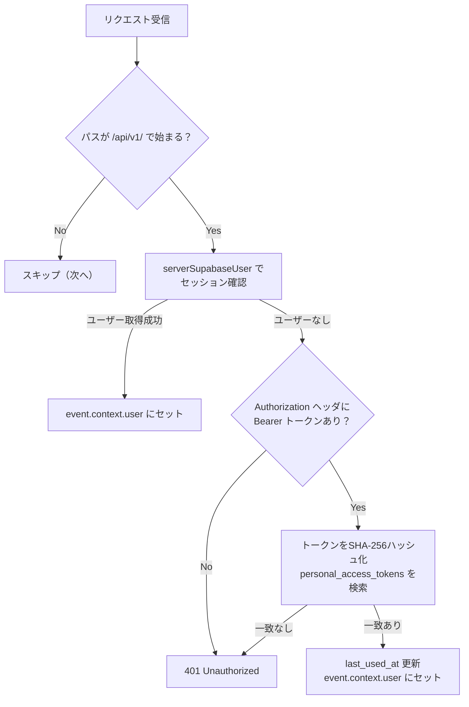

# Nuxt Server API エンドポイント実装計画

## 概要

[docs/API_ENDPOINT.md](docs/API_ENDPOINT.md) に定義された4つのタスクAPIエンドポイントと、PAT発行・管理エンドポイント（2本）、およびそれらを支える認証ミドルウェアを `apps/web/server/` 配下に実装する。`@nuxtjs/supabase` のサーバーユーティリティ (`serverSupabaseClient`, `serverSupabaseServiceRole`, `serverSupabaseUser`) を活用し、Supabaseセッション認証とPAT（パーソナルアクセストークン）認証の両方に対応する。

## ファイル構成

```
apps/web/server/
├── middleware/
│   └── auth.ts                  # /api/v1/** への認証ミドルウェア
├── utils/
│   └── auth.ts                  # PAT検証・ユーザー取得ヘルパー
└── api/
    └── v1/
        ├── tasks/
        │   ├── index.get.ts     # GET  /api/v1/tasks（一覧取得）
        │   ├── index.post.ts    # POST /api/v1/tasks（登録）
        │   ├── [id].get.ts      # GET  /api/v1/tasks/:id（詳細取得）
        │   └── [id].patch.ts    # PATCH /api/v1/tasks/:id（更新）
        └── tokens/
            ├── index.post.ts    # POST /api/v1/tokens（PAT発行）
            └── index.get.ts     # GET  /api/v1/tokens（PAT一覧）
```

## 1. 認証ミドルウェア (`server/middleware/auth.ts`)

`/api/v1/` で始まるリクエストのみを対象に認証処理を行う。

**認証フロー:**



- セッション認証: `serverSupabaseUser(event)` で取得
- PAT認証: `Authorization: Bearer <token>` のトークンをSHA-256でハッシュ化し、`personal_access_tokens` テーブルで照合。一致したら `last_used_at` を更新し、`user_id` からユーザー情報をセット
- PAT検索には `serverSupabaseServiceRole(event)` を使用（RLSバイパスが必要なため）
- 認証済みユーザー情報は `event.context.user` に格納し、各APIハンドラから参照可能にする

## 2. サーバーユーティリティ (`server/utils/auth.ts`)

- `requireUser(event)`: `event.context.user` からユーザーを取得し、未認証なら `createError({ statusCode: 401 })` をスロー
- PAT のハッシュ化ロジック（Web Crypto API の `crypto.subtle.digest` を使用）

## 3. タスクAPI エンドポイント

全エンドポイント共通:
- `requireUser(event)` で認証済みユーザーを取得
- `serverSupabaseClient(event)` でユーザースコープのSupabaseクライアントを取得（RLSによりユーザー自身のデータのみアクセス可能）
- PAT認証の場合はセッションがないため `serverSupabaseServiceRole(event)` を使い、クエリに `.eq('user_id', user.id)` を明示的に付与

### 3-1. POST /api/v1/tasks（タスク登録）

- リクエストボディ: `{ title, list_id?, scheduled_date?, metadata?, ... }`
- `list_id` 未指定時: ユーザーの `lists` テーブルから `is_inbox = true` のレコードを取得して自動割り当て
- `status_id` 未指定時: 割り当てられたリストの `statuses` テーブルから `category = 'TODO'` かつ `sort_order` 最小のレコードを自動割り当て
- バリデーション: `title` は必須

### 3-2. GET /api/v1/tasks（タスク一覧取得）

- クエリパラメータ: `list_id`, `scheduled_date`, `status_id` によるフィルタリング
- `deleted_at IS NULL` で論理削除済みを除外
- `sort_order` 昇順でソート

### 3-3. GET /api/v1/tasks/:id（タスク詳細取得）

- パスパラメータの `id` でタスクを1件取得
- `deleted_at IS NULL` かつユーザー自身のタスクのみ

### 3-4. PATCH /api/v1/tasks/:id（タスク更新）

- リクエストボディ: 部分更新可能なフィールド (`title`, `status_id`, `list_id`, `scheduled_date`, `metadata`, `deleted_at`, `sort_order` 等)
- 論理削除もこのエンドポイントで `deleted_at` をセットして実現
- `updated_at` を現在時刻に自動更新

## 4. PAT発行・管理エンドポイント

PAT認証のテストを行うために、トークン発行と一覧取得のエンドポイントを実装する。これらのエンドポイントはWebのセッション認証でのみアクセス可能とする（PAT認証では利用不可）。

### 4-1. POST /api/v1/tokens（PAT発行）

- リクエストボディ: `{ name }` (トークンの識別名。例: "MacBook CLI")
- 処理フロー:
  1. `crypto.randomUUID()` 等でランダムな生トークン文字列を生成（`nusk_` プレフィックス付き）
  2. SHA-256でハッシュ化した値を `personal_access_tokens.token_hash` に保存
  3. レスポンスで生トークンを **1度だけ** 返却（以降は取得不可）
- レスポンス: `{ id, name, token, created_at }` (`token` は生の値)

### 4-2. GET /api/v1/tokens（PAT一覧取得）

- ユーザーの全PATを一覧取得（`token_hash` は返却しない）
- レスポンス: `[{ id, name, created_at, last_used_at }]`

## 5. 環境変数の追加

[.env](.env) に `SUPABASE_SERVICE_ROLE_KEY` を追加する必要がある（PAT認証のRLSバイパスに使用）。

## 6. 型の活用

`@nusk/shared` から以下の型をインポートして使用:
- `Task`, `List`, `Status` (Row型)
- `Database` (Supabaseクライアントの型パラメータ)

Supabaseの `TablesInsert<'tasks'>` / `TablesUpdate<'tasks'>` 型をAPIのリクエストボディの型として活用する。

## スコープ外（今回は実装しない）

- PAT削除（無効化）エンドポイント
- RLS ポリシーの設定（Supabase側の設定）
- フロントエンドからのAPI呼び出し
