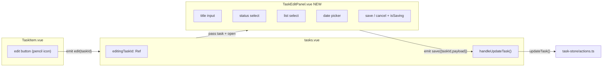

# タスク編集パネルの実装

## 全体アーキテクチャ



## 変更対象ファイル

### 1. task-store に `updateTask` アクションを追加

[`apps/web/composables/task-store/actions.ts`](apps/web/composables/task-store/actions.ts) に新しいアクション関数を追加。既存の `scheduleTask` と同様のパターンで、`api.tasks.update()` を呼び出し、ローカルステートも更新する。

```typescript
async function updateTask(taskId: string, payload: UpdateTaskPayload) {
  const updated = await api.tasks.update(taskId, payload)
  const index = tasks.value.findIndex(t => t.id === taskId)
  if (index !== -1) tasks.value[index] = updated
}
```

- `UpdateTaskPayload` は既に `@nusk/shared` に定義済み（title, status_id, list_id, scheduled_date 等）
- [`apps/web/composables/task-store/index.ts`](apps/web/composables/task-store/index.ts) から re-export

### 2. `TaskEditPanel.vue` を新規作成（契約固定）

[`apps/web/components/TaskEditPanel.vue`](apps/web/components/TaskEditPanel.vue) - 右からスライドインするパネルコンポーネント

- **Props:** `task: Task | null`（null時は非表示）, `lists`, `statuses`, `isSaving`
- **Emits:** `save: { taskId: string, payload: UpdateTaskPayload }`, `close`
- **UI構成:**
  - 半透明バックドロップ（クリックで閉じる）
  - 右端からスライドインするパネル（デスクトップ約50%、タブレット以下は全幅）
  - タイトル入力（テキストフィールド）
  - ステータス選択（select）- 選択中リストに対して有効なステータスのみ表示
  - リスト選択（select / ドロップダウン）- 全リスト一覧
  - 着手予定日（date input + カレンダーアイコン）- 既存 TaskInput のパターンを参考
  - 保存ボタン / キャンセルボタン（`isSaving` 中は無効）
- **A11y:**
  - `role="dialog"` + `aria-modal="true"` + タイトルID連携
  - `Esc` で閉じる
  - 開いたときにタイトル入力へフォーカス
- **スタイル:** BEM（`.task-edit-panel__xxx`）、SCSS、Vue transition によるスライドアニメーション

### 3. `TaskItem.vue` に編集ボタンを追加

[`apps/web/components/TaskItem.vue`](apps/web/components/TaskItem.vue)

- `Pencil`（lucide-vue-next）アイコンの編集ボタンを追加
- ホバー時に表示（既存のドラッグハンドルと同様の opacity トランジション）
- 新しい emit: `edit` を追加
- ボタン配置はアクションボタン群（「今日やる」「明日やる」の隣、またはタイトル右側）

### 4. `tasks.vue`（ページ）で編集パネルをオーケストレーション

[`apps/web/pages/tasks.vue`](apps/web/pages/tasks.vue)

- `editingTaskId` リアクティブステートを追加
- `editingTask` computed（editingTaskId から tasks 配列を検索）
- `isSavingEdit` を追加し、二重送信を防止
- `handleEdit(taskId)` ハンドラ - editingTaskId を設定
- `handleUpdateTask({ taskId, payload })` ハンドラ:
  - `updateTask()` 成功時: 成功Toast表示、パネルを閉じる
  - 失敗時: 失敗Toast表示、パネルを開いたまま維持
- TaskItem の `@edit` イベントをハンドル
- TaskEditPanel をテンプレートに配置

### 5. `TaskDateSection.vue` の対応

[`apps/web/components/TaskDateSection.vue`](apps/web/components/TaskDateSection.vue)

- TaskItem の `@edit` イベントを親（tasks.vue）にバブルアップ
- 新しい emit: `edit-task` を追加
- `tasks.vue` 側で `@edit-task="handleEdit"` を明示接続

## 整合性ルール（確定）

- **ステータス候補:** `status.list_id === selectedListId || status.list_id === null`
- **リスト変更時:** 現在 `status_id` が新リストで無効なら、次の優先順で補正
  1. 新リストの `TODO` カテゴリ
  2. グローバル `TODO`
  3. 候補の先頭
- **バリデーション:** タイトル空は保存不可
- **Transition:** Vue の `<Transition>` で右スライドアニメーション

## 品質要件

- **エラーハンドリング:** API失敗時はパネルを閉じず、エラートーストを表示
- **重複送信防止:** 保存中は `isSavingEdit` を true にし、保存/閉じる操作を制限
- **レスポンシブ:** 1024px以下でパネル全幅表示
- **A11y:** Escクローズ、初期フォーカス、dialog属性の付与
