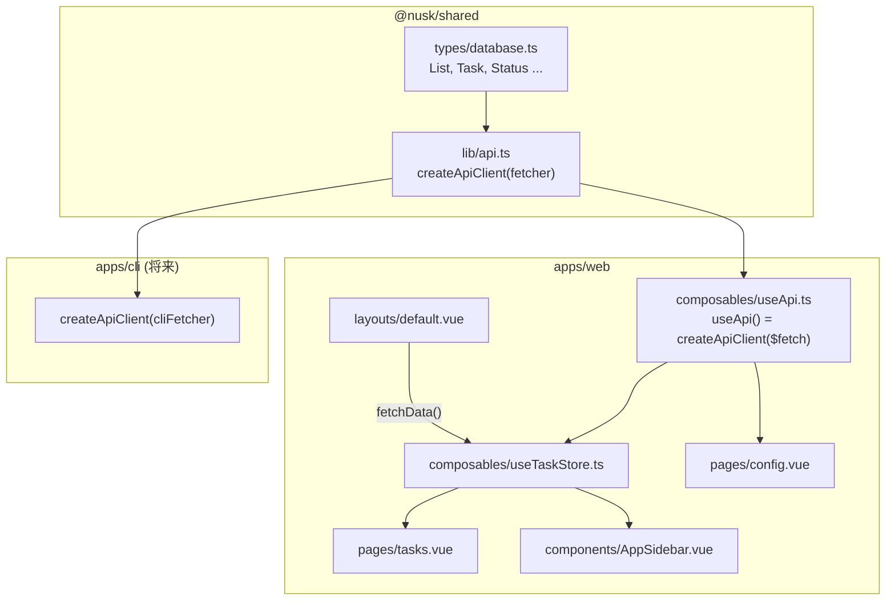

# タスク画面 DB 連携 + API クライアント集約

## 現状の課題

- [`useTaskStore.ts`](apps/web/composables/useTaskStore.ts): ハードコードされたモックデータを使用
- [`config.vue`](apps/web/pages/config.vue): `$fetch('/api/v1/...')` を直接呼び出し、エンドポイントURLが散在
- API エンドポイントは既に完成済みだが、クライアント側に型付きの API 呼び出し層がない

## アーキテクチャ（変更後）



## 変更対象ファイル

### 1. `packages/shared/lib/api.ts` -- 新規作成

ファクトリーパターンで fetcher を注入し、Web（`$fetch`）と CLI（カスタムfetcher）の両方に対応。
`@nusk/shared` の `List`, `Task`, `Status` 型を使ってレスポンスを型付け。

```typescript
import type { List, Status, Task, StatusCategory } from '../index'

interface FetchOptions {
  method?: string
  body?: unknown
  query?: Record<string, string | undefined>
}

type Fetcher = <T>(url: string, options?: FetchOptions) => Promise<T>

export function createApiClient(fetcher: Fetcher) {
  return {
    lists: {
      getAll: () => fetcher<List[]>('/api/v1/lists'),
      create: (body: { name: string; is_inbox?: boolean; sort_order?: number }) =>
        fetcher<List>('/api/v1/lists', { method: 'POST', body }),
      update: (id: string, body: { name?: string; sort_order?: number; is_inbox?: boolean }) =>
        fetcher<List>(`/api/v1/lists/${id}`, { method: 'PATCH', body }),
      delete: (id: string) =>
        fetcher<null>(`/api/v1/lists/${id}`, { method: 'DELETE' }),
    },
    statuses: {
      getAll: (query?: { list_id?: string }) =>
        fetcher<Status[]>('/api/v1/statuses', { query }),
      create: (body: { name: string; category?: StatusCategory; color?: string; sort_order?: number; list_id?: string | null }) =>
        fetcher<Status>('/api/v1/statuses', { method: 'POST', body }),
      update: (id: string, body: { name?: string; category?: StatusCategory; color?: string; sort_order?: number; list_id?: string | null }) =>
        fetcher<Status>(`/api/v1/statuses/${id}`, { method: 'PATCH', body }),
      delete: (id: string) =>
        fetcher<null>(`/api/v1/statuses/${id}`, { method: 'DELETE' }),
    },
    tasks: {
      getAll: (query?: { list_id?: string; scheduled_date?: string; status_id?: string }) =>
        fetcher<Task[]>('/api/v1/tasks', { query }),
      get: (id: string) => fetcher<Task>(`/api/v1/tasks/${id}`),
      create: (body: { title: string; list_id?: string; status_id?: string; scheduled_date?: string | null }) =>
        fetcher<Task>('/api/v1/tasks', { method: 'POST', body }),
      update: (id: string, body: { title?: string; status_id?: string; list_id?: string; scheduled_date?: string | null; sort_order?: number; deleted_at?: string | null }) =>
        fetcher<Task>(`/api/v1/tasks/${id}`, { method: 'PATCH', body }),
    },
    setup: {
      init: (body: { lists?: Array<{ name: string; is_inbox: boolean }>; statuses?: Array<{ name: string; category: StatusCategory; color: string }> }) =>
        fetcher<unknown>('/api/v1/setup/init', { method: 'POST', body }),
    },
  }
}
```

### 2. `packages/shared/index.ts` -- エクスポート追加

```typescript
export { createApiClient } from './lib/api'
```

### 3. `apps/web/composables/useApi.ts` -- 新規作成

Nuxt の `$fetch` をラップして API クライアントを提供する composable。

```typescript
import { createApiClient } from '@nusk/shared'

export const useApi = () => createApiClient($fetch)
```

### 4. `useTaskStore.ts` -- DB 連携に書き換え

- ローカルインターフェース定義を削除し、`@nusk/shared` の `List`, `Status`, `Task` 型を使用
- モックデータを空配列に置き換え
- `useApi()` を使って全 API 呼び出しを実装
- `fetchData()` / `loading` / `loaded` を追加
- `addTask` / `scheduleTask` / `completeTask` を async 化し API と同期

### 5. `config.vue` -- API 呼び出しを `useApi()` 経由に統一

- `$fetch('/api/v1/...')` の直接呼び出しを全て `api.lists.*` / `api.statuses.*` / `api.setup.*` に置き換え
- ロジックの変更は最小限（URL文字列を関数呼び出しに変えるのみ）

### 6. `default.vue` -- データ初期化トリガー

- `<script setup>` を追加し、`useTaskStore().fetchData()` を `onMounted` で呼び出す

### 7. `tasks.vue` -- ローディング UI 追加

- `loading` 状態を store から取得し、読み込み中はローディング表示
- 既存のテンプレート構造は変更なし

### 8. `AppSidebar.vue` -- 変更なし

- `useTaskStore` のリアクティブな `lists` を参照しているため、自動的にDBデータが表示される
