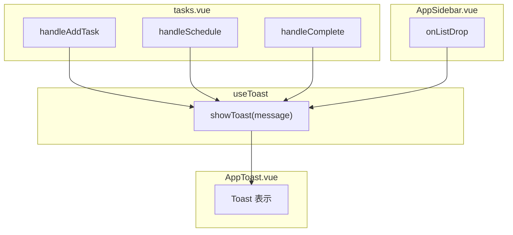

# Toast 通知システムへのリファクタリング

## 現状

- [tasks.vue](apps/web/pages/tasks.vue) 内に UndoToast がインライン実装されている（L35-78, L164-169, L275-300）
- Undo 機能（`undoSchedule`, `scheduleWithUndo` 等）が含まれている
- スケジュール変更時のみ Toast が表示される
- タスク追加・完了トグル・リスト移動時には通知がない

## 方針

- `useToast` composable を新規作成し、`useState` でグローバルに共有
- `AppToast.vue` コンポーネントを新規作成し、レイアウト (`default.vue`) に配置
- Undo 機能は削除し、シンプルな通知メッセージのみに変更
- 各タスクアクションの呼び出し元で `showToast()` を呼ぶ

## 1. `useToast` composable の新規作成

**ファイル:** `apps/web/composables/useToast.ts`

```ts
export function useToast() {
  const message = useState<string>('toast-message', () => '')
  const visible = useState<boolean>('toast-visible', () => false)
  const timer = ref<ReturnType<typeof setTimeout> | null>(null)

  function showToast(msg: string, duration = 3000) {
    if (timer.value) clearTimeout(timer.value)
    message.value = msg
    visible.value = true
    timer.value = setTimeout(() => {
      visible.value = false
      message.value = ''
      timer.value = null
    }, duration)
  }

  return { message: readonly(message), visible: readonly(visible), showToast }
}
```

- `useState` を使いグローバルシングルトンにする（SSR 対応）
- `showToast(msg)` を呼ぶだけで通知を表示、3 秒後に自動消去

## 2. `AppToast.vue` コンポーネントの新規作成

**ファイル:** `apps/web/components/AppToast.vue`

- `useToast()` から `message` / `visible` を取得して表示
- `Transition` でフェードイン/アウトアニメーション付き
- Undo ボタンは不要、メッセージのみのシンプルな表示
- スタイルは現在の `tasks__undo-toast` を流用・リネーム（BEM: `.toast__message`）

## 3. レイアウトへの配置

**ファイル:** [default.vue](apps/web/layouts/default.vue)

- `<AppToast />` をテンプレートに追加（`<slot />` の後）

## 4. `tasks.vue` のリファクタリング

**ファイル:** [tasks.vue](apps/web/pages/tasks.vue)

削除するもの:
- Undo 関連の ref 5 つ (`undoTaskId`, `undoPrevDate`, `undoMessage`, `showUndo`, `undoTimer`)
- `clearUndoTimer()`, `openUndoToast()`, `scheduleWithUndo()`, `undoSchedule()` 関数
- テンプレートの `tasks__undo-toast` ブロック (L164-169)
- スタイルの `&__undo-toast`, `&__undo-message`, `&__undo-btn` (L275-300)

追加するもの:
- `useToast()` の `showToast` を利用
- スケジュール変更用ハンドラ: `scheduleTask` + `showToast` のシンプルな関数
- タスク追加時: `handleAddTask` 内で `showToast('タスクを追加しました')`
- 完了トグル時: ラッパー関数で `completeTask` + `showToast`

変更後の通知メッセージ例:
- 追加: `「{タスク名}」を追加しました`
- スケジュール: `「{タスク名}」を今日に移動しました`
- 完了: `「{タスク名}」を完了しました` / `「{タスク名}」を未完了に戻しました`

## 5. `AppSidebar.vue` の更新

**ファイル:** [AppSidebar.vue](apps/web/components/AppSidebar.vue)

- `useToast()` を追加
- `onListDrop` 内で `moveTaskToList` 完了後に `showToast` を呼ぶ
- タスク名・リスト名はストアの `tasks` / `lists` から取得
- メッセージ: `「{タスク名}」を「{リスト名}」に移動しました`

## データフロー


