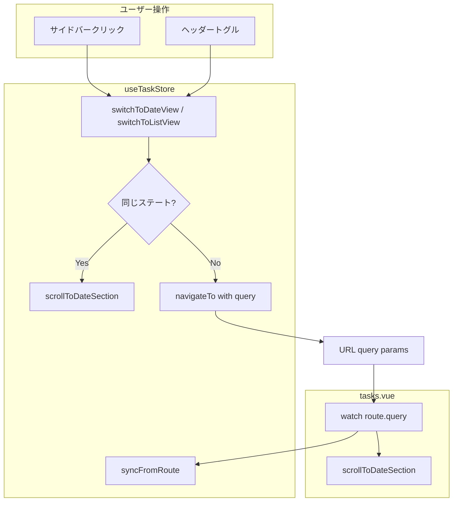

# URLクエリパラメータによるビューステート管理

## 問題の根本原因

現在のスクロール制御は `watch(selectedDateGroup, ...)` に依存しているが、Vueのリアクティビティは**同じ値への再代入を検知しない**。URLにステートが反映されていないため、以下の問題がある:

- 同じ日付グループを再クリックしてもスクロールしない
- ブラウザの戻る/進むでビュー状態が復元されない
- ページリフレッシュで状態がリセットされる

## 解決方針

URLクエリパラメータをビューステートの**単一情報源 (Single Source of Truth)**として使い、全てのビュー切り替えを `navigateTo()` 経由にする。

### URL設計

| ビュー | URL例 |
|---|---|
| リストビュー (Inbox) | `/tasks?view=list&list=<listId>` |
| 日付ビュー (今日) | `/tasks?view=date&group=today` |
| 日付ビュー (明日) | `/tasks?view=date&group=tomorrow` |
| デフォルト (クエリなし) | `/tasks` → リストビュー + Inbox |

### 「同じ値」問題の対処

`navigateTo()` は同じURLへの遷移を無視するため、`switchToDateView` / `switchToListView` 内で「既に同じステートか」を判定し、同じ場合は `navigateTo` をスキップして**直接スクロール処理**を実行する。

## 変更対象ファイルと内容

### 1. [useTaskStore.ts](apps/web/composables/useTaskStore.ts)

- `switchToDateView(group)` を変更:
  - 既に同じ `view=date & group` なら → 直接 `scrollToDateSection(group)` を呼ぶ
  - それ以外 → `navigateTo({ path: '/tasks', query: { view: 'date', group } })` を実行
- `switchToListView(listId)` を変更:
  - `navigateTo({ path: '/tasks', query: { view: 'list', list: listId } })` を実行
- `scrollToDateSection(group)` ユーティリティ関数を新設:
  - `nextTick` 後に `document.getElementById(...)?.scrollIntoView(...)` を呼ぶ
- `syncFromRoute(query)` 関数を新設:
  - `route.query` からストアステート (`viewMode`, `selectedListId`, `selectedDateGroup`) を復元

```typescript
function scrollToDateSection(group: DateGroupKey) {
  nextTick(() => {
    document
      .getElementById(`date-section-${group}`)
      ?.scrollIntoView({ behavior: 'smooth', block: 'start' })
  })
}

function switchToDateView(group: DateGroupKey = 'today') {
  if (viewMode.value === 'date' && selectedDateGroup.value === group) {
    scrollToDateSection(group)
    return
  }
  navigateTo({ path: '/tasks', query: { view: 'date', group } })
}

function switchToListView(listId: string) {
  if (viewMode.value === 'list' && selectedListId.value === listId) return
  navigateTo({ path: '/tasks', query: { view: 'list', list: listId } })
}

function syncFromRoute(query: Record<string, string>) {
  const view = query.view as 'list' | 'date' | undefined
  if (view === 'date') {
    viewMode.value = 'date'
    const group = (query.group as DateGroupKey) || 'today'
    selectedDateGroup.value = group
  } else {
    viewMode.value = 'list'
    if (query.list) selectedListId.value = query.list
  }
}
```

### 2. [tasks.vue](apps/web/pages/tasks.vue)

- 既存の `watch(selectedDateGroup, ...)` を**削除**
- `route.query` の `watch` を追加:
  - クエリ変更時に `syncFromRoute` を呼んでストアを同期
  - `view=date` の場合は `scrollToDateSection` でスクロール実行
- ヘッダーの「リスト」ボタンの `@click="viewMode = 'list'"` を `@click="switchToListView(selectedListId)"` に変更

```typescript
const route = useRoute()

watch(() => route.query, (query) => {
  syncFromRoute(query as Record<string, string>)
  if (query.view === 'date') {
    scrollToDateSection((query.group as DateGroupKey) || 'today')
  }
}, { immediate: true })
```

### 3. [AppSidebar.vue](apps/web/components/AppSidebar.vue)

- 変更不要。既に `switchToDateView` / `switchToListView` を呼んでおり、これらの内部実装が `navigateTo` を使うように変わるだけ。

## データフロー



## 補足

- `fetchData()` で初回ロード後に Inbox を自動選択する既存ロジックは、URLにクエリがない場合 (`/tasks`) のみ発動するよう調整する
- `MiniCalendar` や `TaskFilterBar` はストアの `viewMode` / `selectedDateGroup` を参照しており、ルートクエリ経由で同期されるため変更不要
