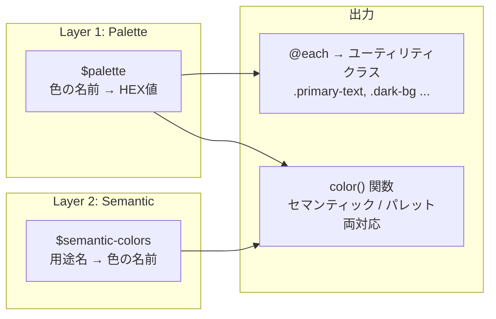

# カラーシステム再設計 -- 2層構造 + ユーティリティクラス生成

## 現在の問題

`$colors` マップのキーが `'text'`, `'bg'`, `'surface'` など用途ベースの名前になっており、ユーティリティクラスを生成すると `.text-text`, `.bg-bg` のような無意味なクラスになる。

## 新しい2層構造



### Layer 1: `$palette` -- 色名 → HEX値

明るさ順に並べた形容詞ベースの命名。ユーティリティクラスはここから自動生成される。

| 名前 | HEX | 明るさの目安 |
|------|-----|-------------|
| `dark` | `#111111` | 最暗 |
| `charcoal` | `#4b5563` | 暗め |
| `slate` | `#6b7280` | 中暗 |
| `gray` | `#999999` | 中間 |
| `silver` | `#9ca3af` | 中明 |
| `mist` | `#d1d5db` | 淡め |
| `ash` | `#e5e7eb` | 明るめ |
| `cloud` | `#f3f4f6` | ほぼ白 |
| `smoke` | `#f5f5f5` | ほぼ白 |
| `snow` | `#f9fafb` | ほぼ白 |
| `white` | `#ffffff` | 最明 |
| `primary` | `#f97316` | -- |
| `primary-light` | `#fff7ed` | -- |
| `blue` | `#2563eb` | -- |
| `blue-light` | `#eff6ff` | -- |
| `green` | `#059669` | -- |
| `green-light` | `#ecfdf5` | -- |
| `danger` | `#dc2626` | -- |
| `danger-light` | `#fef2f2` | -- |
| `danger-pale` | `#fecaca` | -- |

### Layer 2: `$semantic-colors` -- 用途名 → パレットキー

`color()` 関数を呼ぶ際の従来のセマンティックキーを維持する。

```scss
$semantic-colors: (
  'text':           'dark',
  'text-secondary': 'gray',
  'text-muted':     'silver',
  'text-gray':      'slate',
  'text-calendar':  'charcoal',
  'text-disabled':  'mist',
  'bg':             'smoke',
  'surface':        'white',
  'surface-muted':  'snow',
  'border':         'ash',
  'border-light':   'cloud',
  'border-danger':  'danger-pale',
  'status-blue':    'blue',
  'status-blue-bg': 'blue-light',
  'status-green':   'green',
  'status-green-bg':'green-light',
  'danger-bg':      'danger-light',
);
```

### `color()` 関数の解決ロジック

```
color('text')     → $semantic-colors で 'dark' に解決 → $palette で #111111 を返す
color('primary')  → $semantic-colors に無い → $palette で直接 #f97316 を返す
color('dark')     → $semantic-colors に無い → $palette で直接 #111111 を返す
```

### ユーティリティクラス生成

新規ファイル [apps/web/assets/scss/_utilities.scss](apps/web/assets/scss/_utilities.scss) で `@each` を使い自動生成。

```scss
@each $name, $value in $palette {
  .#{$name}-text { color: $value; }
  .#{$name}-bg { background-color: $value; }
  .#{$name}-border { border-color: $value; }
}
```

生成例: `.primary-text`, `.primary-bg`, `.primary-border`, `.dark-text`, `.dark-bg`, `.blue-text`, `.blue-bg` ...

## 変更対象ファイル

| ファイル | 変更内容 |
|---------|----------|
| [_variables.scss](apps/web/assets/scss/_variables.scss) | `$colors` を `$palette` + `$semantic-colors` に分割 |
| [_functions.scss](apps/web/assets/scss/_functions.scss) | `color()` を2層解決ロジックに更新 |
| **_utilities.scss** (新規) | `@each` でユーティリティクラスを生成 |
| [_index.scss](apps/web/assets/scss/_index.scss) | `@forward 'utilities'` 不要（CSS出力側のため） |
| [nuxt.config.ts](apps/web/nuxt.config.ts) | `css` 配列に `_utilities.scss` を追加 |
| [_mixins.scss](apps/web/assets/scss/_mixins.scss) | 変更不要（`color()` 経由のため自動追従） |
| [_global.scss](apps/web/assets/scss/_global.scss) | 変更不要（同上） |
| 4つの .vue ファイル | 変更不要（`color('text')` 等のセマンティックキーがそのまま動く） |
| [design-system.mdc](.cursor/rules/design-system.mdc) | カラーリファレンス表を2層構造に更新 |
