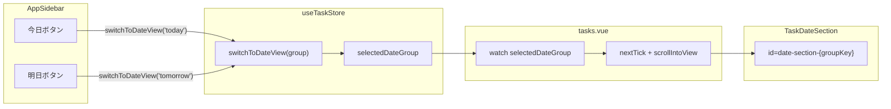

# サイドバー日付ビュー改善

## 変更の全体像

## 変更対象ファイル (4ファイル)

### 1. [apps/web/composables/useTaskStore.ts](apps/web/composables/useTaskStore.ts)

- `selectedDateGroup` ステート（`useState<DateGroupKey>('selected-date-group', () => 'today')`）を追加
- `switchToDateView(group?: DateGroupKey)` に引数を追加し、`selectedDateGroup` をセットする（デフォルト `'today'`）
- `selectedDateGroup` を return に追加

### 2. [apps/web/components/AppSidebar.vue](apps/web/components/AppSidebar.vue)

- 「リスト」セクションの「日付ビュー」ボタン（36-46行目）を削除
- `CalendarDays` インポートと `dateViewTotalCount` 分割代入を削除
- 「今日」ボタン: `@click="switchToDateView('today')"` + アクティブ状態 `:class="{ 'sidebar__item--active': viewMode === 'date' && selectedDateGroup === 'today' }"`
- 「明日」ボタン: `@click="switchToDateView('tomorrow')"` + アクティブ状態 `:class="{ 'sidebar__item--active': viewMode === 'date' && selectedDateGroup === 'tomorrow' }"`
- `selectedDateGroup` を `useTaskStore()` の分割代入に追加

### 3. [apps/web/components/TaskDateSection.vue](apps/web/components/TaskDateSection.vue)

- ルート `<section>` に `:id="'date-section-' + groupKey"` を追加（スクロールターゲット用）

### 4. [apps/web/pages/tasks.vue](apps/web/pages/tasks.vue)

- `useTaskStore()` から `selectedDateGroup` を取得
- `selectedDateGroup` を watch し、`viewMode === 'date'` の時に `nextTick` 後に `document.getElementById('date-section-' + group)?.scrollIntoView({ behavior: 'smooth', block: 'start' })` でスクロール
- ヘッダーの日付トグルボタン（47行目）の `@click` も `switchToDateView()` を使うように変更（viewMode直接書き換えからストアアクション経由に統一）

## 補足

- `selectedDateGroup` のデフォルトは `'today'` にし、日付ビューに入った時は常に「今日」がアクティブになるようにする
- スクロールは `behavior: 'smooth'` でスムーズスクロールにする
