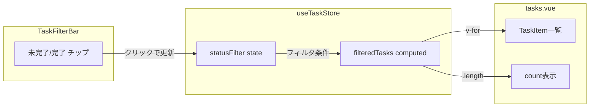

# ステータスによるタスク絞り込み実装

## 現状の整理

- ステータスカテゴリは `"TODO" | "IN_PROGRESS" | "DONE"` の3種（[database.ts](packages/shared/types/database/database.ts) L219）
- `filteredTasks` は `selectedListId` のみでフィルタ（[useTaskStore.ts](apps/web/composables/useTaskStore.ts) L40-42）
- `TaskFilterBar` の「ステータス」ボタンは見た目だけで未実装（[TaskFilterBar.vue](apps/web/components/TaskFilterBar.vue) L25-28）

## 実装方針

### 1. useTaskStore にステータスフィルター状態を追加

[`apps/web/composables/useTaskStore.ts`](apps/web/composables/useTaskStore.ts) を変更:

- `statusFilter` ステートを追加（型: `'all' | 'incomplete' | 'done'`、初期値: `'all'`）
- `filteredTasks` の computed を拡張し、`statusFilter` に応じて追加フィルタリング:
  - `'all'` → 従来通り（フィルタなし）
  - `'incomplete'` → `category !== 'DONE'` のタスクのみ（TODO + IN_PROGRESS）
  - `'done'` → `category === 'DONE'` のタスクのみ
- `statusFilter` を return に追加してエクスポート

```typescript
const statusFilter = useState<'all' | 'incomplete' | 'done'>('status-filter', () => 'all')

const filteredTasks = computed(() => {
  let result = tasks.value.filter(t => t.list_id === selectedListId.value)
  if (statusFilter.value === 'incomplete') {
    result = result.filter(t => {
      const status = statuses.value.find(s => s.id === t.status_id)
      return status?.category !== 'DONE'
    })
  } else if (statusFilter.value === 'done') {
    result = result.filter(t => {
      const status = statuses.value.find(s => s.id === t.status_id)
      return status?.category === 'DONE'
    })
  }
  return result
})
```

### 2. TaskFilterBar にチップ型ボタンを追加

[`apps/web/components/TaskFilterBar.vue`](apps/web/components/TaskFilterBar.vue) を変更:

- `useTaskStore()` から `statusFilter` を取得
- 「ステータス」ボタンの横に「未完了」「完了」チップボタンを配置
- チップクリックでトグル動作（同じものを再クリックで `'all'` に戻す）
- アクティブ状態のチップに `--active` modifier でスタイル適用（背景色・ボーダーで視覚的に区別）

```
[ステータス] [未完了] [完了]   ← このような横並びレイアウト
```

- `count` propsは従来通り tasks.vue 側の `filteredTasks.length` が渡されるので、ストア側で `filteredTasks` が変われば自動的にカウントも追従する

### 3. tasks.vue の変更は不要

`filteredTasks` はストア側で既にステータスフィルタを適用済みになるため、tasks.vue 側のコードは変更不要。`filteredTasks.length` がそのままカウントに反映される。

## データフロー


