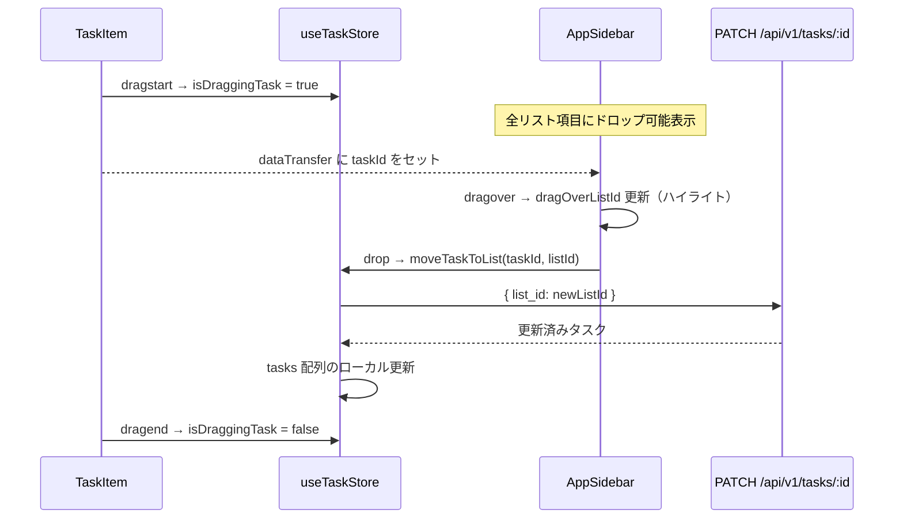

# タスクドラッグ&ドロップによるリスト移動

## 方針

- **ライブラリ不要**: HTML5 ネイティブ Drag and Drop API を使用（[config.vue](apps/web/pages/config.vue) のリスト並べ替えと同じパターン）
- **API は対応済み**: `PATCH /api/v1/tasks/[id]` の `list_id` フィールドでリスト移動が可能（[`[id].patch.ts`](apps/web/server/api/v1/tasks/[id].patch.ts) L13-23）
- ストアに `moveTaskToList` アクションを追加し、楽観的にローカルステートも更新する

## データフロー

## 変更対象ファイル

### 1. [`useTaskStore.ts`](apps/web/composables/useTaskStore.ts) -- ストアにドラッグ状態と移動アクションを追加

- `isDraggingTask` ステート追加（`useState<boolean>`）: ドラッグ中かどうかをコンポーネント間で共有
- `moveTaskToList(taskId: string, listId: string)` アクション追加:
  - `api.tasks.update(taskId, { list_id: listId })` を呼び出し
  - ローカルの `tasks` 配列で該当タスクを更新
- return に `isDraggingTask` と `moveTaskToList` を追加

### 2. [`TaskItem.vue`](apps/web/components/TaskItem.vue) -- ドラッグ開始の発火元

- `GripVertical` アイコン（lucide-vue-next）をチェックボックスの左に追加
  - 通常時は非表示（`opacity: 0`）、ホバー時にフェードイン表示（`config.vue` の `config-list-item__grip` と同様のパターン）
  - `cursor: grab` を適用し、ドラッグ可能であることを視覚的に示す
- ルート `<article>` に `draggable="true"` を付与
- `@dragstart` ハンドラ: `event.dataTransfer.setData('application/x-task-id', task.id)` + `isDraggingTask = true`
- `@dragend` ハンドラ: `isDraggingTask = false`
- ドラッグ中スタイル: `opacity: 0.4` を適用するクラスを追加

### 3. [`AppSidebar.vue`](apps/web/components/AppSidebar.vue) -- ドロップターゲット

- `isDraggingTask` / `moveTaskToList` を store から取得
- ローカル `dragOverListId` ref を追加
- サイドバーのリスト `<button>` に以下のイベントを追加:
  - `@dragover.prevent`: `dragOverListId = list.id`（+ `dropEffect = 'move'`）
  - `@dragleave`: `dragOverListId = null`
  - `@drop`: `dataTransfer` から taskId を取得し `moveTaskToList(taskId, list.id)` を呼び出し
- CSS:
  - `sidebar__item--drop-ready`: `isDraggingTask` が true のとき全リスト項目に適用（薄い枠線やアイコンで「ここにドロップできます」を表現）
  - `sidebar__item--drag-over`: `dragOverListId` が一致する項目に適用（プライマリカラーのハイライト）
