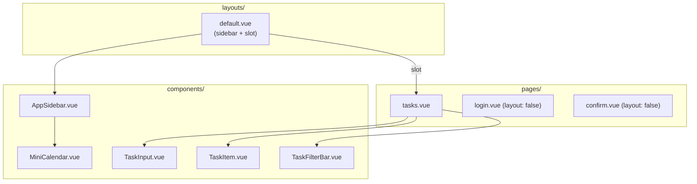

# タスク画面 Figmaデザイン実装プラン

## アーキテクチャ概要

Nuxt の Layout 機能でサイドバーをレイアウトに切り出し、UIパーツをコンポーネントに分割する。



## Figmaデザインとの差分

Figmaデザイン(node-id=4-2)と現在の [tasks.vue](apps/web/pages/tasks.vue) を比較:

- **サイドバー**: セクションラベル(リスト/日付)、日付ナビ(今日/明日+件数)、ミニカレンダーが未実装
- **メインエリア**: ビュー切替タブ、タスク入力フォーム、フィルターバー、「今日やる/明日やる」ボタン、日付のオレンジハイライトが未実装

## ファイル構成と責務

### 新規作成ファイル

- [layouts/default.vue](apps/web/layouts/default.vue) -- 2カラムレイアウト。AppSidebar + `<slot />`
- [components/AppSidebar.vue](apps/web/components/AppSidebar.vue) -- ロゴ、リストナビ、日付ナビ、MiniCalendar、ユーザー情報、ログアウト
- [components/MiniCalendar.vue](apps/web/components/MiniCalendar.vue) -- 当月カレンダー。今日をオレンジハイライト。前月末日はグレー表示
- [components/TaskInput.vue](apps/web/components/TaskInput.vue) -- dashed checkbox + input + カレンダーアイコン + 追加ボタン。elevated shadow カード
- [components/TaskItem.vue](apps/web/components/TaskItem.vue) -- 1タスク行: checkbox, title, status badge, date(今日ハイライト/日付なし), 今日やる/明日やるボタン
- [components/TaskFilterBar.vue](apps/web/components/TaskFilterBar.vue) -- 「フィルター」ラベル + 縦線 + 優先度/期限/ステータスボタン

### 変更ファイル

- [pages/tasks.vue](apps/web/pages/tasks.vue) -- サイドバーを削除、ヘッダー(タイトル+pill件数+ビュー切替) + コンポーネント組み合わせに簡素化
- [pages/login.vue](apps/web/pages/login.vue) -- `definePageMeta({ layout: false })` を追加
- [pages/confirm.vue](apps/web/pages/confirm.vue) -- `definePageMeta({ layout: false })` を追加

## コンポーネント設計

### layouts/default.vue

2カラム flex レイアウト。左に `<AppSidebar />`、右に `<slot />`。
タスクデータ(lists, tasks, statuses 等)やサイドバーの状態(selectedListId, viewMode)は `tasks.vue` から provide/inject またはコンポーザブルで共有。初期実装では props/emits ベースで対応する。

```
.layout { display: flex; min-height: 100vh; }
  AppSidebar (width: 260px)
  .layout__main (flex: 1) → <slot />
```

### AppSidebar.vue

- props: `lists`, `selectedListId`, `todayCount`, `tomorrowCount`, `user`
- emits: `update:selectedListId`, `logout`
- セクション「リスト」: リスト一覧 (Inbox/仕事/プライベート) + 各件数
- セクション「日付」: 今日/明日 + 各件数
- `<MiniCalendar />` をインライン配置
- フッター: ユーザーアバター+名前、ログアウトボタン
- BEM: `.sidebar__*`

### MiniCalendar.vue

- props なし (内部で `new Date()` から算出)
- 7列グリッド: 曜日ヘッダー(日/月/火/水/木/金/土) + 5-6行の日付セル
- 今日: `background: color('primary'); color: white; border-radius: 2px`
- 前月の日: `color: color('text-disabled')`
- BEM: `.calendar__*`

### TaskInput.vue

- emits: `add(title: string)`
- dashed border checkbox + `<input>` placeholder "新しいタスクを追加..." + カレンダーアイコン + 「追加」ボタン
- カード全体に `shadow('elevated')` を適用
- BEM: `.task-input__*`

### TaskItem.vue

- props: `task` (Task型), `statusName` (string), `statusCategory` ('TODO'|'IN_PROGRESS'|'DONE')
- emits: `schedule-today`, `schedule-tomorrow`
- チェックボックス + タイトル + ステータスバッジ + 日付表示 + 「今日やる」「明日やる」ボタン
- 日付が今日: オレンジ色 + カレンダーアイコン(オレンジ) + 「（今日）」テキスト
- 日付なし: グレー「日付なし」テキスト
- 通常日付: グレー + カレンダーアイコン + "M/D"
- BEM: `.task-item__*`

### TaskFilterBar.vue

- props/emits なし (表示のみ、将来のフィルター機能のプレースホルダー)
- 「フィルター」ラベル (フィルターアイコン + テキスト) + 縦区切り線 + 「優先度」「期限」「ステータス」ボタン
- BEM: `.filter-bar__*`

## スタイル方針

- 全コンポーネント: `<style lang="scss" scoped>` + BEM ネスト構造
- 既存デザイントークン (`_variables.scss`, `_functions.scss`, `_mixins.scss`) を最大限活用
- SVG アイコンは inline SVG で実装
- カレンダーの曜日ヘッダーはテキスト(日/月/火/水/木/金/土)で実装
