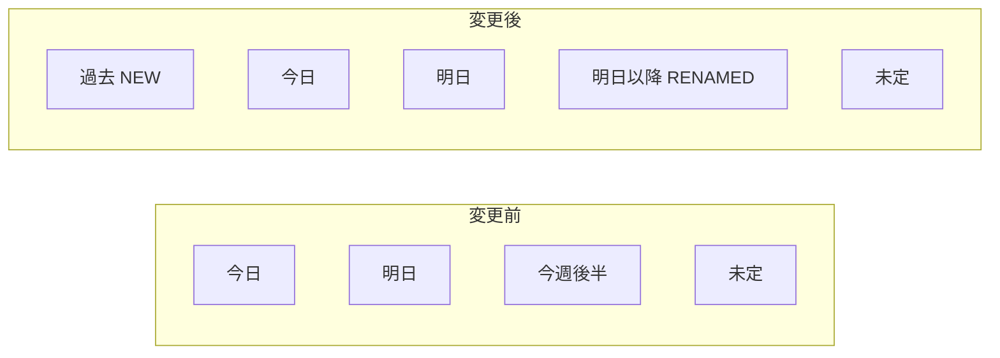

# 日付グループ拡張: 明日以降 / 未定 / 過去 の追加

## 現状

- **サイドバー日付欄**: 「今日」「明日」の2項目のみ
- **タスク日付グループ**: 「今日」「明日」「今週後半」「未定」の4グループ
- `DateGroupKey` = `'today' | 'tomorrow' | 'laterThisWeek' | 'undated'`
- 「今週後半」は明後日〜今週日曜のみが対象で、来週以降のタスクは表示されない
- 過去日付のタスクもどのグループにも入らず表示されない

## 変更後

- **サイドバー日付欄**: 「今日」「明日」「明日以降」「過去」「未定」の5項目
- **タスク日付グループ**: 「過去」「今日」「明日」「明日以降」「未定」の5グループ
- `DateGroupKey` = `'overdue' | 'today' | 'tomorrow' | 'upcoming' | 'undated'`

## 変更ファイルと内容

### 1. [apps/web/composables/useTaskStore.ts](apps/web/composables/useTaskStore.ts)

- `DateGroupKey` 型を更新: `laterThisWeek` → `upcoming`, `overdue` 追加
- `getEndOfWeekStr` / `endOfWeekStr` は不要になるため削除
- `dateGroupedTasks` computed を更新:
  - `overdue` グループ追加: `d < today` のタスク（過去日付）
  - `laterThisWeek` → `upcoming` にリネーム: 条件を `d > tomorrow` に変更（週末制限を撤廃し、明後日以降の全タスクを含む）
  - グループ順序: overdue → today → tomorrow → upcoming → undated
  - ラベル: 「過去」「今日 (M月D日)」「明日 (M月D日)」「明日以降」「未定」
- 件数 computed 追加:
  - `upcomingCount`: `d > tomorrowStr` のタスク数
  - `overdueCount`: `d < todayStr` のタスク数
  - `undatedCount`: `d === null` のタスク数
- return オブジェクトに新しい count を追加

### 2. [apps/web/components/AppSidebar.vue](apps/web/components/AppSidebar.vue)

- store から `upcomingCount`, `overdueCount`, `undatedCount` を取得
- lucide-vue-next から追加アイコンをインポート（例: `ArrowRight` / `CircleHelp` / `History`）
- 日付セクションに3項目追加:
  - 「明日以降」ボタン: `switchToDateView('upcoming')` / upcomingCount
  - 「過去」ボタン: `switchToDateView('overdue')` / overdueCount
  - 「未定」ボタン: `switchToDateView('undated')` / undatedCount

### 3. [apps/web/components/TaskDateSection.vue](apps/web/components/TaskDateSection.vue)

- `DateGroupKey` 型が変更されるのでコメント更新のみ（コンポーネント自体は generic なので動作に影響なし）
- `hideScheduleToday` / `hideScheduleTomorrow` の条件に `overdue` グループの考慮を追加（過去グループでも「今日やる」「明日やる」ボタンを表示すべき）

### 4. [apps/web/pages/tasks.vue](apps/web/pages/tasks.vue)

- `DateGroupKey` 型の import は既存のまま（型の変更は useTaskStore 側で完結）
- 変更不要の見込み
