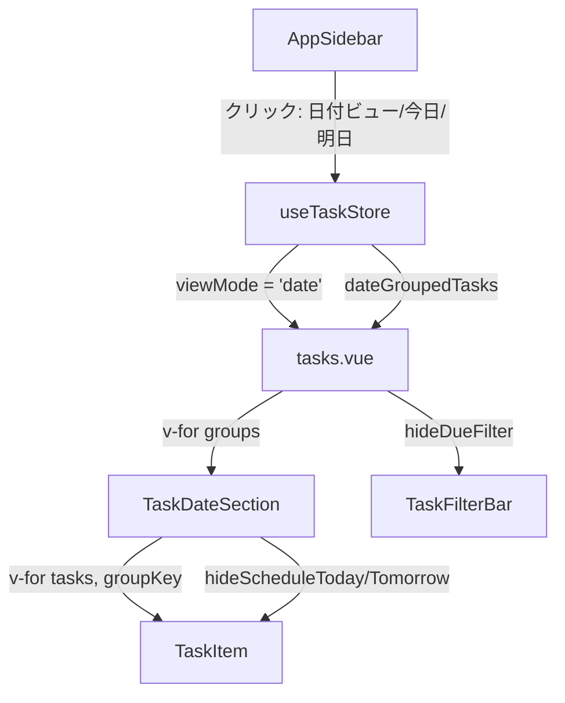

# 日付ビュー（デザインB）実装プラン

## デザイン仕様（Figma node 12-719 より）

- タイトル: 「今後のタスク N件」
- サイドバー: リストセクションに「日付ビュー」項目を追加（選択時にアクティブ化）
- 日付グループセクション（区切り線 + ラベル）で以下の4グループに分割:
  - **今日 (M月D日)** -- 「今日やる」ボタン非表示、「明日やる」のみ
  - **明日 (M月D日)** -- 「明日やる」ボタン非表示、「今日やる」のみ
  - **今週後半** -- 両ボタン表示（明後日〜今週末）
  - **未定** -- `scheduled_date` が null のタスク、両ボタン表示
- フィルターバー: 「期限」ボタンを非表示（日付で既にグルーピングされているため）
- 空のグループは「タスクはありません」を表示

---

## 変更ファイル一覧

### 1. [useTaskStore.ts](apps/web/composables/useTaskStore.ts) -- ストアに日付グルーピングロジックを追加

- `selectedDate` は不要（デザインBは全日付を一覧表示するため）
- サイドバーから日付ビューに切り替えるアクション `switchToDateView()` を追加
- 日付グルーピング用の computed `dateGroupedTasks` を追加:

```typescript
interface DateGroup {
  key: 'today' | 'tomorrow' | 'laterThisWeek' | 'undated'
  label: string       // "今日 (3/17)" etc.
  tasks: Task[]
}
```

- グルーピングロジック:
  - `today`: `scheduled_date === todayStr`
  - `tomorrow`: `scheduled_date === tomorrowStr`
  - `laterThisWeek`: `scheduled_date` が明後日〜今週日曜の範囲
  - `undated`: `scheduled_date === null`
- `statusFilter` は日付ビューにも適用する（グループ内のタスクをフィルタ）

### 2. [tasks.vue](apps/web/pages/tasks.vue) -- 日付ビュー時のレンダリング分岐

- `viewMode === 'list'` の時: 現在のまま（リスト名タイトル + フラットなタスク一覧）
- `viewMode === 'date'` の時:
  - タイトルを「今後のタスク N件」に変更
  - `TaskInput` は共通で表示
  - `TaskFilterBar` も共通で表示（ただし日付ビューフラグを渡す）
  - `dateGroupedTasks` をループし、グループごとに `TaskDateSection` を描画

### 3. 新規: [TaskDateSection.vue](apps/web/components/TaskDateSection.vue) -- 日付グループセクション

- Props: `label`（グループ名）、`tasks`（タスク配列）、`groupKey`（today/tomorrow/laterThisWeek/undated）
- 構造:
  - 区切り線付きのグループラベル（Figmaのデザイン通り）
  - タスクがあれば `TaskItem` を v-for でレンダリング
  - タスクがなければ「タスクはありません」を表示
- `groupKey` を `TaskItem` に渡し、ボタン表示制御に使用

### 4. [TaskItem.vue](apps/web/components/TaskItem.vue) -- ボタンの条件付き表示

- 新しい props を追加:
  - `hideScheduleToday`: boolean (default: false) -- 「今日やる」を非表示
  - `hideScheduleTomorrow`: boolean (default: false) -- 「明日やる」を非表示
- `TaskDateSection` から `groupKey === 'today'` の時に `hideScheduleToday=true`、`groupKey === 'tomorrow'` の時に `hideScheduleTomorrow=true` を渡す
- リストビューでは従来通り両ボタン表示（ただし PAGE_FLOW.md 仕様の「期日が今日の場合は非表示」も同時に対応）

### 5. [TaskFilterBar.vue](apps/web/components/TaskFilterBar.vue) -- 日付ビュー時に「期限」ボタンを非表示

- 新しい prop: `hideDueFilter`: boolean (default: false)
- `viewMode === 'date'` の時に `hideDueFilter=true` を渡す

### 6. [AppSidebar.vue](apps/web/components/AppSidebar.vue) -- サイドバー連動

- リストセクションの先頭に「日付ビュー」項目を追加（Figmaでは既存リストと同じセクションに配置）
- クリック時: `viewMode = 'date'` に切り替え
- 日付セクションの「今日」「明日」クリック時も `viewMode = 'date'` に切り替え
- `viewMode === 'date'` の時は「日付ビュー」がアクティブ状態、リスト項目は非アクティブ
- リスト項目クリック時は `viewMode = 'list'` に戻す

### 7. [docs/PAGE_FLOW.md](docs/PAGE_FLOW.md) -- 仕様更新

- 日付ビューの仕様をデザインBに合わせて更新（4グループ構成、ボタン制御ルール）

### 8. docs/TODO.md -- 新規作成

- フェーズ3の残タスク一覧を集約（前回整理した内容をベースに、日付ビューは「実装中」に更新）

---

## データフロー図


