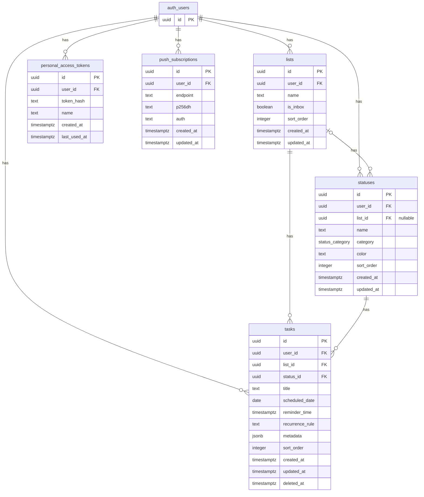

# Database Schema (supabase)

```sql
-- 1. 状態の内部カテゴリ用Enum（システム制御用）
CREATE TYPE status_category AS ENUM ('TODO', 'IN_PROGRESS', 'DONE');

-- 2. Lists (箱) テーブル
CREATE TABLE lists (
  id UUID PRIMARY KEY DEFAULT gen_random_uuid(),
  user_id UUID NOT NULL REFERENCES auth.users(id) ON DELETE CASCADE,
  name TEXT NOT NULL,
  is_inbox BOOLEAN DEFAULT FALSE,
  sort_order INTEGER NOT NULL DEFAULT 0,
  created_at TIMESTAMPTZ DEFAULT NOW(),
  updated_at TIMESTAMPTZ DEFAULT NOW()
);

-- 3. Statuses (状態) テーブル
-- ※list_id が NULL の場合はグローバルステータス（全リスト共通）
-- ※list_id が指定されている場合はそのリスト固有のステータス
CREATE TABLE statuses (
  id UUID PRIMARY KEY DEFAULT gen_random_uuid(),
  user_id UUID NOT NULL REFERENCES auth.users(id) ON DELETE CASCADE,
  list_id UUID REFERENCES lists(id) ON DELETE CASCADE,
  name TEXT NOT NULL, -- 例: "未対応", "レビュー中"
  category status_category NOT NULL DEFAULT 'TODO', -- システムが「完了」などを判定するため
  color TEXT DEFAULT '#94a3b8', -- ステータスバッジの表示色 (HEX)
  sort_order INTEGER NOT NULL DEFAULT 0,
  created_at TIMESTAMPTZ DEFAULT NOW(),
  updated_at TIMESTAMPTZ DEFAULT NOW()
);

-- 4. Tasks (タスク本体) テーブル
CREATE TABLE tasks (
  id UUID PRIMARY KEY DEFAULT gen_random_uuid(),
  user_id UUID NOT NULL REFERENCES auth.users(id) ON DELETE CASCADE,
  list_id UUID NOT NULL REFERENCES lists(id) ON DELETE CASCADE,
  status_id UUID NOT NULL REFERENCES statuses(id),
  title TEXT NOT NULL,
  scheduled_date DATE, -- 着手予定日 (Today/Tomorrow判定用)
  reminder_time TIMESTAMPTZ, -- プッシュ通知のトリガー時間
  recurrence_rule TEXT, -- 繰り返しルール (例: 'FREQ=WEEKLY;BYDAY=MO')
  metadata JSONB DEFAULT '{}'::jsonb, -- ★自由拡張メタデータ (タグ、重要度など)
  sort_order INTEGER NOT NULL DEFAULT 0, -- リスト内での手動並び替え用
  created_at TIMESTAMPTZ DEFAULT NOW(),
  updated_at TIMESTAMPTZ DEFAULT NOW(),
  deleted_at TIMESTAMPTZ -- 論理削除用 (NULLの場合は有効)
);

-- 5. Personal Access Tokens (CLI用トークン) テーブル
CREATE TABLE personal_access_tokens (
  id UUID PRIMARY KEY DEFAULT gen_random_uuid(),
  user_id UUID NOT NULL REFERENCES auth.users(id) ON DELETE CASCADE,
  token_hash TEXT NOT NULL UNIQUE,
  name TEXT NOT NULL, -- 例: "MacBook CLI"
  created_at TIMESTAMPTZ DEFAULT NOW(),
  last_used_at TIMESTAMPTZ
);

-- 6. Push Subscriptions (Web Push通知購読情報) テーブル
CREATE TABLE push_subscriptions (
  id UUID PRIMARY KEY DEFAULT gen_random_uuid(),
  user_id UUID NOT NULL REFERENCES auth.users(id) ON DELETE CASCADE,
  endpoint TEXT NOT NULL UNIQUE,
  p256dh TEXT NOT NULL,
  auth TEXT NOT NULL,
  created_at TIMESTAMPTZ DEFAULT NOW(),
  updated_at TIMESTAMPTZ DEFAULT NOW()
);

-- インデックスの作成 (検索パフォーマンス最適化)
CREATE INDEX idx_tasks_user_id ON tasks(user_id);
CREATE INDEX idx_tasks_list_id ON tasks(list_id);
CREATE INDEX idx_tasks_scheduled_date ON tasks(scheduled_date);
CREATE INDEX idx_tasks_deleted_at ON tasks(deleted_at);
CREATE INDEX idx_statuses_user_id ON statuses(user_id);
CREATE INDEX idx_pat_user_id ON personal_access_tokens(user_id);
CREATE INDEX idx_push_sub_user_id ON push_subscriptions(user_id);
```

## ER 図


